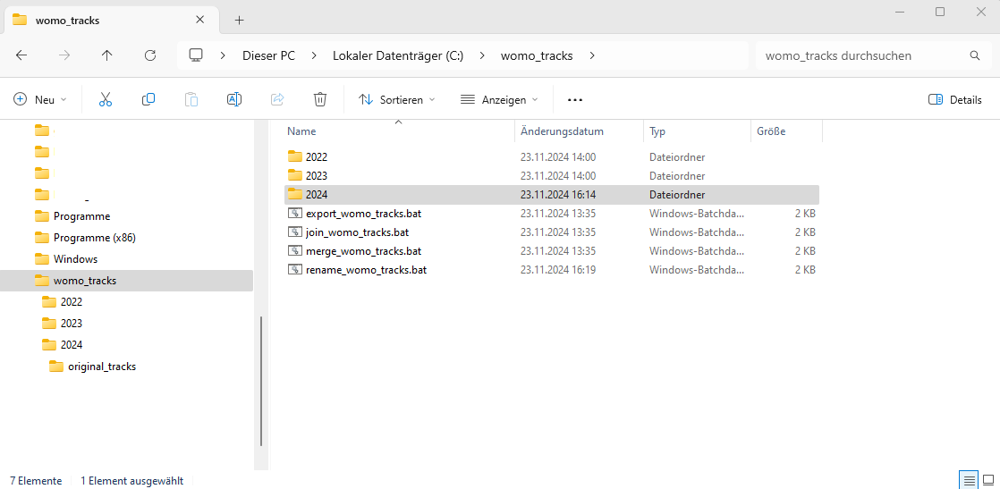
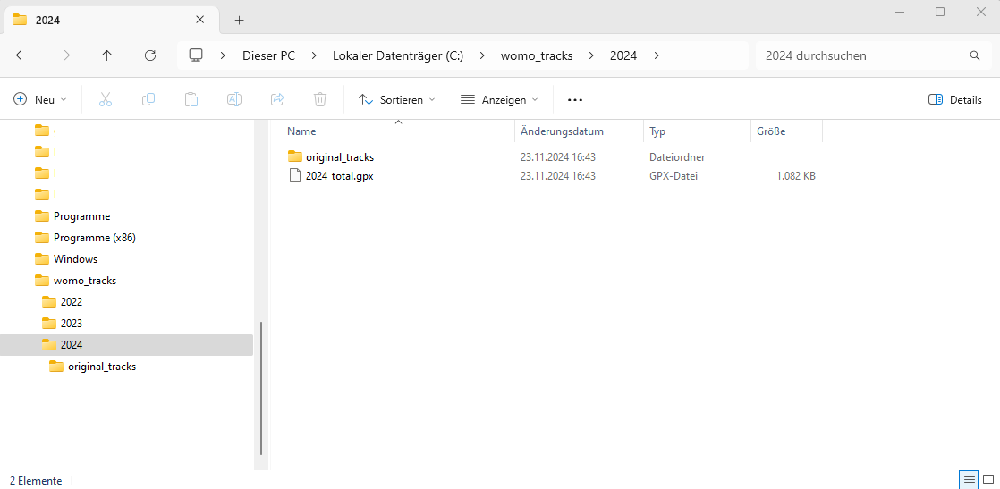
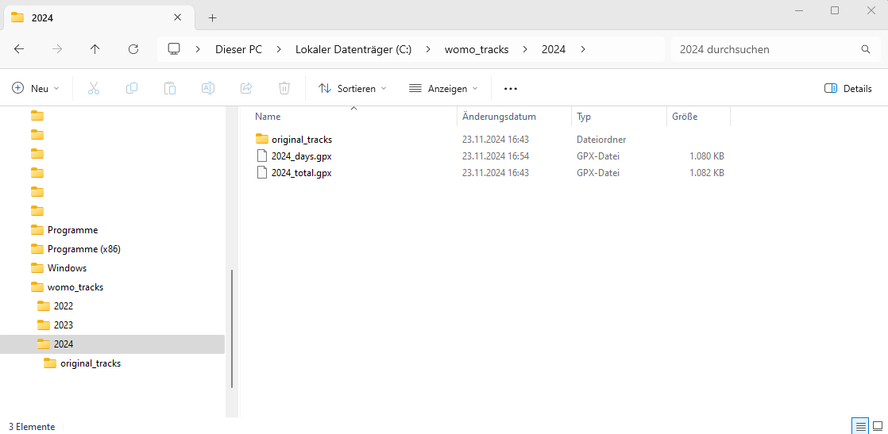
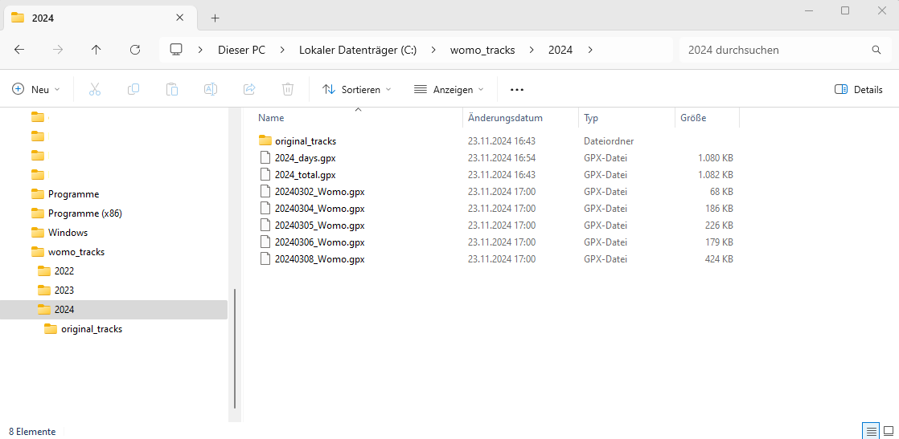

# Trip Log Pioneer AVIC Z1000-DAB
 

[deutsche Version](README_de.md) 

 **Modify trip log of an Pioneer AVIC Z1000-DAB.**

Every year I get the trip list from my Pioneer Avic Z1000-DAB sat nav.
And like in previous years, I was once again annoyed that the files had what I thought was an impossible file name.
OK, I've adjusted it.

But then it continues: There may be several files per day (I still don't understand why that is, and even less what criteria are used to start a new file). Be that as it may, I'll just create one file per day myself.

To ensure that all of this doesn't turn into a week-long task, I started to automate it in previous years. Here it is.
If someone can use it, then all the better. I'm deliberately limiting myself to the Pioneer Avic Z1000-DAB because I don't know what might be different with other devices.

For such "small" automations, I try to get by with Windows tools wherever possible. For this, however, I used [gpsbabel](https://www.gpsbabel.org/) and created four small batch scripts around it.

There are four scripts because I like it when there are small intermediate steps that can also be checked manually to track down errors.

**Note:** My Pioneer AVIC Z1000-DAB is set to German language. For this reason all names are in German.

What kind of scripts are these and what are they used for?
- `rename_womo_tracks.bat`: The files in the trip list on my navigation system are called something like this: `Fahrt 006 - 05-03-2024 16-44-33.gpx`. But I would like a file name that looks like this: `Fahrt_2024-03-05_16-44-33.gpx`.
And this script does exactly that. It renames all the files.

- `join_womo_tracks.bat`: I have between 500 and 1000 individual files in the trip list every year. There may be several files for individual days. 
This script combines all the files in the trip list and saves all the tracks in one file. The renamed files from the previous script serve as the basis.

- `merge_womo_tracks.bat`: The previous script created a file with many tracks, including several tracks per day. This script creates a new file with one track per day.

- `export_womo_tracks.bat`: each individual track from the previously created file gets exported as a single file, i.e. you then have one file (= track) per day


Let's get started!

## What to do?

- I recommend creating a new directory for this job and since I do this every year, for example: `C:\womo_tracks\2024`.

- Get the trip list from the **Pioneer Avic Z1000-DAB** navigation system and copy the individual files in the trip list into a subdirectory of the directory created above, e.g. `C:\womo_tracks\2024\original_tracks`.
It then looks like this, for example:
 

- Install [gpsbabel](https://www.gpsbabel.org/)  and ideally make a note of where the tool is installed, e.g. `C:\Program Files\GPSBabel`. If you haven't remembered it, or if you already have the tool installed, then you just have to look for it.

- Copy the four scripts to your own computer (e.g. to `C:\womo_tracks`) and adapt them.


### Adjusting the scripts

### `rename_womo_tracks.bat`
Within the file please adjust the two values
| Value | description |
|-|-|
| `set OLDFILENAMEPREFIX=Fahrt` | Information about how the files in the trip list begin. If the device language is set to German, the entry is `Fahrt` and if the language is set to English, the entry is `Trip`. This applies to other language settings ​​accordingly. Just look at how your files start and enter it here.|
|`set NEWFILENAMEPREFIX=Fahrt_`| Specifies how the renamed files should begin. It's your decision. All characters that can be used in file names are allowed. Please note that this is not checked and leads to unexpected errors.|

### `join_womo_tracks.bat`
Within the file please adjust the two values
| Value | description |
|-|-|
| `set GPXSCRIPT="C:\Program Files\GPSBabel\gpsbabel.exe"` | enter the path to `gpsbabel.exe` on your PC|
| `set NEWFILENAMEPREFIX=Fahrt_` | it must be the same value as in `rename_womo_tracks.bat` |

### `merge_womo_tracks.bat`
Within the file please adjust the two values
| Value | description |
|-|-|
| `set GPXSCRIPT="C:\Program Files\GPSBabel\gpsbabel.exe"` | enter the path to gpsbabel.exe on your PC|
| `set TRACKNAMEPART=_Womo` | Track names are formed from the date in the form YYYYMMDD with this value appended to it, e.g. `20241123_Womo`. All characters that can be used in file names are allowed. Please note that this is not checked and leads to unexpected errors.|

### `export_womo_tracks.bat`
Within the file please adjust the value
| Value | description |
|-|-|
| `set GPXSCRIPT="C:\Program Files\GPSBabel\gpsbabel.exe"` | enter the path to gpsbabel.exe on your PC|


### Calling the scripts

Now everything is ready to run the scripts. To do this, open a command line window and change to the directory with the scripts.


1. Call *rename_all_womo_tracks.bat*  with one parameter

   USAGE: `rename_womo_tracks.bat directory`

   | parameter | description |
   |-|-|
   |`directory`| directory containing the gpx files to be renamed |

    Example:

    ```
    C:\womo_tracks> rename_womo_tracks.bat .\2024\original_tracks

    trackdir=.\2024\original_tracks
    startdir=C:\womo_tracks
    trackfile=".\.\2024\original_tracks\Fahrt 001 - 02-03-2024 16-48-31.gpx"
    rename "C:\womo_tracks\.\2024\original_tracks\Fahrt 001 - 02-03-2024 16-48-31.gpx " "Fahrt_2024-03-02_16-48-31.gpx"
    ========
    trackfile=".\.\2024\original_tracks\Fahrt 002 - 04-03-2024 08-20-34.gpx"
    rename "C:\womo_tracks\.\2024\original_tracks\Fahrt 002 - 04-03-2024 08-20-34.gpx " "Fahrt_2024-03-04_08-20-34.gpx"
    ========
    trackfile=".\.\2024\original_tracks\Fahrt 003 - 04-03-2024 08-27-38.gpx"
    rename "C:\womo_tracks\.\2024\original_tracks\Fahrt 003 - 04-03-2024 08-27-38.gpx " "Fahrt_2024-03-04_08-27-38.gpx"
    ========
    trackfile=".\.\2024\original_tracks\Fahrt 004 - 04-03-2024 15-57-07.gpx"
    rename "C:\womo_tracks\.\2024\original_tracks\Fahrt 004 - 04-03-2024 15-57-07.gpx " "Fahrt_2024-03-04_15-57-07.gpx"
    ========
    trackfile=".\.\2024\original_tracks\Fahrt 005 - 05-03-2024 13-14-53.gpx"
    rename "C:\womo_tracks\.\2024\original_tracks\Fahrt 005 - 05-03-2024 13-14-53.gpx " "Fahrt_2024-03-05_13-14-53.gpx"
    ========
    trackfile=".\.\2024\original_tracks\Fahrt 006 - 05-03-2024 16-44-33.gpx"
    rename "C:\womo_tracks\.\2024\original_tracks\Fahrt 006 - 05-03-2024 16-44-33.gpx " "Fahrt_2024-03-05_16-44-33.gpx"
    ========
    trackfile=".\.\2024\original_tracks\Fahrt 007 - 06-03-2024 10-51-13.gpx"
    rename "C:\womo_tracks\.\2024\original_tracks\Fahrt 007 - 06-03-2024 10-51-13.gpx " "Fahrt_2024-03-06_10-51-13.gpx"
    ========
    trackfile=".\.\2024\original_tracks\Fahrt 008 - 06-03-2024 11-03-56.gpx"
    rename "C:\womo_tracks\.\2024\original_tracks\Fahrt 008 - 06-03-2024 11-03-56.gpx " "Fahrt_2024-03-06_11-03-56.gpx"
    ========
    trackfile=".\.\2024\original_tracks\Fahrt 009 - 06-03-2024 11-21-29.gpx"
    rename "C:\womo_tracks\.\2024\original_tracks\Fahrt 009 - 06-03-2024 11-21-29.gpx " "Fahrt_2024-03-06_11-21-29.gpx"
    ========
    trackfile=".\.\2024\original_tracks\Fahrt 010 - 06-03-2024 11-24-19.gpx"
    rename "C:\womo_tracks\.\2024\original_tracks\Fahrt 010 - 06-03-2024 11-24-19.gpx " "Fahrt_2024-03-06_11-24-19.gpx"
    ========
    trackfile=".\.\2024\original_tracks\Fahrt 011 - 06-03-2024 13-26-10.gpx"
    rename "C:\womo_tracks\.\2024\original_tracks\Fahrt 011 - 06-03-2024 13-26-10.gpx " "Fahrt_2024-03-06_13-26-10.gpx"
    ========
    trackfile=".\.\2024\original_tracks\Fahrt 012 - 08-03-2024 10-33-46.gpx"
    rename "C:\womo_tracks\.\2024\original_tracks\Fahrt 012 - 08-03-2024 10-33-46.gpx " "Fahrt_2024-03-08_10-33-46.gpx"
    ========
    trackfile=".\.\2024\original_tracks\Fahrt 013 - 08-03-2024 10-39-47.gpx"
    rename "C:\womo_tracks\.\2024\original_tracks\Fahrt 013 - 08-03-2024 10-39-47.gpx " "Fahrt_2024-03-08_10-39-47.gpx"
    ========

    C:\womo_tracks>
    ```

    

2. Call *join_womo_tracks.bat* with two parameters

   USAGE: `join_womo_tracks.bat  directory joinedgpxfile`

   | parameter | description |
   |-|-|
   |`directory`| directory with the gpx files to be joined, typically the same as in the call to `rename_womo_tracks.bat`|
   |`joinedgpxfile`| path and file name for the joined tracks|

    Example:

    ```
    C:\womo_tracks> join_womo_tracks.bat .\2024\original_tracks .\2024\2024_total.gpx

    GPXSCRIPT="C:\Program Files\GPSBabel\gpsbabel.exe"
    FILENAMEPART=Fahrt_
    trackdir=.\2024\original_tracks
    joinedgpxfile=.\2024\2024_total.gpx
    inputfilelist=.\2024\original_tracks\inputfilelist.tmp
    join file: ".\2024\original_tracks\Fahrt_2024-03-02_16-48-31.gpx"
    join file: ".\2024\original_tracks\Fahrt_2024-03-04_08-20-34.gpx"
    join file: ".\2024\original_tracks\Fahrt_2024-03-04_08-27-38.gpx"
    join file: ".\2024\original_tracks\Fahrt_2024-03-04_15-57-07.gpx"
    join file: ".\2024\original_tracks\Fahrt_2024-03-05_13-14-53.gpx"
    join file: ".\2024\original_tracks\Fahrt_2024-03-05_16-44-33.gpx"
    join file: ".\2024\original_tracks\Fahrt_2024-03-06_10-51-13.gpx"
    join file: ".\2024\original_tracks\Fahrt_2024-03-06_11-03-56.gpx"
    join file: ".\2024\original_tracks\Fahrt_2024-03-06_11-21-29.gpx"
    join file: ".\2024\original_tracks\Fahrt_2024-03-06_11-24-19.gpx"
    join file: ".\2024\original_tracks\Fahrt_2024-03-06_13-26-10.gpx"
    join file: ".\2024\original_tracks\Fahrt_2024-03-08_10-33-46.gpx"
    join file: ".\2024\original_tracks\Fahrt_2024-03-08_10-39-47.gpx"
    "C:\Program Files\GPSBabel\gpsbabel.exe" -t -b .\2024\original_tracks\inputfilelist.tmp  -o gpx -F .\2024\2024_total.gpx
    
    C:\womo_tracks>
    ```
    


3. Call *merge_womo_tracks.bat* with two parameters

   USAGE: `merge_womo_tracks.bat  joinedgpxfile mergedgpxfile`

   | parameter | description |
   |-|-|
   |`joinedgpxfile`| path and file name with the joined tracks|
   |`mergedgpxfile`| path and file name for the merged tracks|

    Example:

    ```
    C:\womo_tracks> merge_womo_tracks.bat .\2024\2024_total.gpx .\2024\2024_days.gpx

    GPXSCRIPT="C:\Program Files\GPSBabel\gpsbabel.exe"
    TRACKNAMEPART=_Womo
    joinedgpxfile=.\2024\2024_total.gpx
    mergedgpxfile=.\2024\2024_days.gpx
    "C:\Program Files\GPSBabel\gpsbabel.exe" -t -i gpx -f .\2024\2024_total.gpx -x track,merge,split,title=%Y%m%d_Womo -o gpx -F .\2024\2024_days.gpx
    
    C:\womo_tracks>
    ```
    
    


4. Call *export_womo_tracks.bat* with one parameter

   USAGE: `export_womo_tracks.bat  mergedgpxfile`

   | parameter | description |
   |-|-|
   |`mergedgpxfile`| gpx file with the (merged) tracks|

    Example:

    ```    
   C:\womo_tracks> export_womo_tracks.bat .\2024\2024_days.gpx
   GPXSCRIPT="C:\Program Files\GPSBabel\gpsbabel.exe"
   mergedgpxfile=.\2024\2024_days.gpx
   folder=C:\womo_tracks\2024\
   write track=20240302_Womo
   write track=20240304_Womo
   write track=20240305_Womo
   write track=20240306_Womo
   write track=20240308_Womo

   C:\womo_tracks>
   ```    

   


## Notes
These scripts were created iteratively and quick and dirty and there is no claim that they are error-free and work in every situation.

The scripts could probably be developed better and some things solved more easily, but for me it is sufficient at the moment.

## License

Copyright (c) 2022 - 2024 jpgorganizer, https://github.com/jpgorganizer 

Trip Log Pioneer AVIC Z1000-DAB by jpgorganizer is licensed under a 
Creative Commons Attribution-NonCommercial-ShareAlike 4.0 International License 
[(CC-BY-NC-SA-4.0)](https://creativecommons.org/licenses/by-nc-sa/4.0/) 
Based on a work at https://github.com/jpgorganizer/ioBroker.smartgarden. 
 

<!--- SVN: $Rev: 3209 $ $Date: 2024-05-25 12:16:16 +0200 (Sa, 25 Mai 2024) $ --->


