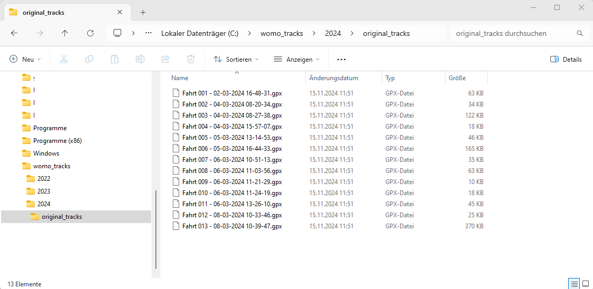
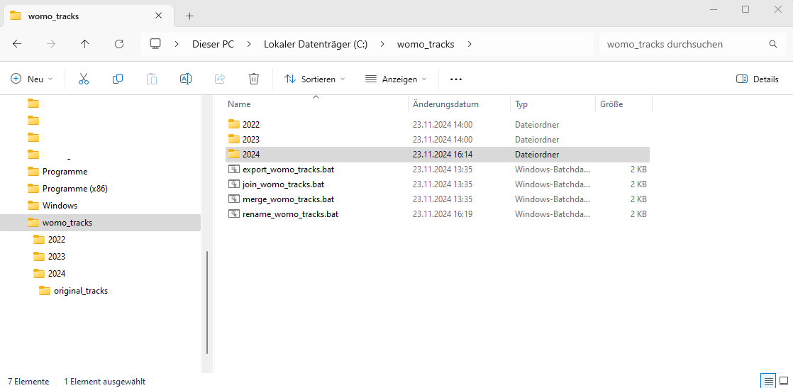
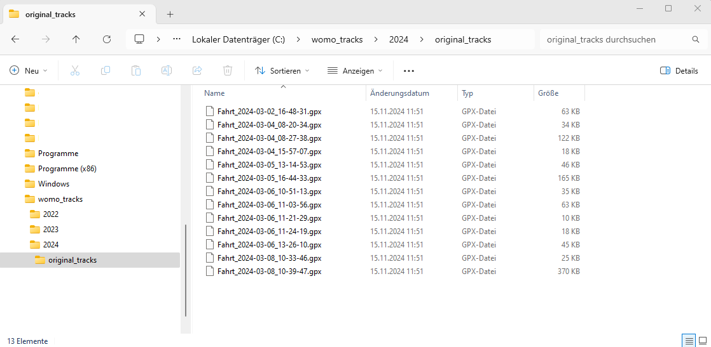
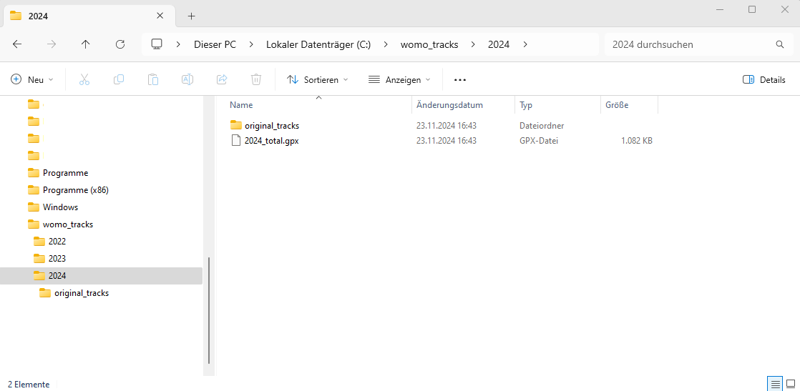
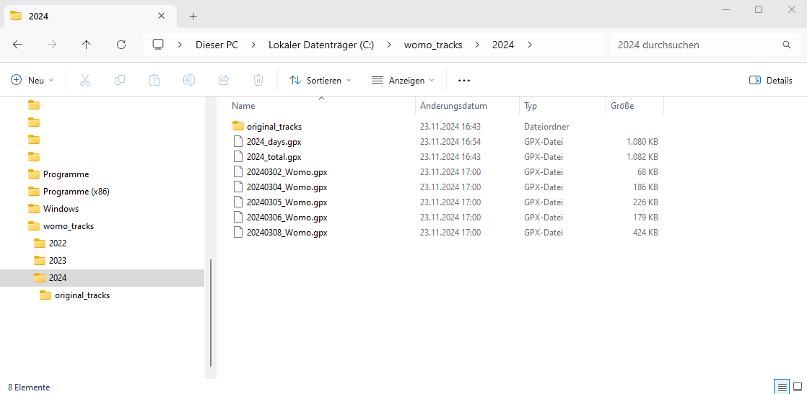

# Fahrtenliste Pioneer AVIC Z1000-DAB
 

[english version](README.md) 

 **Fahrtenliste eines Pioneer AVIC Z1000-DAB anpassen**

Jedes Jahr hole ich mir die Fahrtenliste von meinem Pioneer Avic Z1000-DAB Navi. Und wie schon
in den Jahren zuvor ärgerte ich mich auch dieses Mal wieder darüber, dass die Dateien einen für mich
unmöglichen Dateinamen hatten. OK, habe ich angepasst.

Aber dann geht es weiter: Es können mehrere Dateien pro Tag sein (warum das so ist, verstehe ich noch
immer nicht, und noch weniger, nach welchen Kriterien eine neue Datei angelegt wird). Wie dem auch
sei, ich selbst werde einfach nur eine Datei pro Tag anlegen

Damit das Ganze nicht zu einer wochenlangen Aufgabe wird, habe ich in den vergangenen
Jahren damit begonnen, es zu automatisieren. Hier ist es. Wenn es jemand gebrauchen kann,
umso besser. Ich beschränke mich bewusst auf das Pioneer Avic Z1000-DAB, da ich nicht weiß,
was bei anderen Geräten anders sein könnte.

Für solche „kleinen“ Automatisierungen versuche ich, wenn möglich, mit Windows-Tools auszukommen. Hierzu habe ich allerdings [gpsbabel](https://www.gpsbabel.org/) verwendet und darum herum vier kleine Batch-Skripte erstellt.

Es sind vier Skripte, weil ich es gut finde, wenn es kleine Zwischenschritte gibt, die man auch manuell
prüfen kann, um Fehler aufzuspüren.

**Hinweis:** Mein Pioneer AVIC Z1000-DAB ist auf die deutsche Sprache eingestellt. Aus diesem
Grund sind alle Namen auf Deutsch.

Um welche Skripte handelt es sich und wozu werden sie verwendet?
- `rename_womo_tracks.bat`: Die Dateien in der Fahrtenliste auf meinem Navi heißen etwa so: `Fahrt 006 - 05-03-2024 16-44-33.gpx`. Ich hätte aber gerne einen Dateinamen der so aussieht: `Fahrt_2024-03-05_16-44-33.gpx`.
Und genau das macht dieses Skript. Es benennt alle Dateien
um.

- `join_womo_tracks.bat`: Ich habe zwischen 500 und 1000 einzelne Dateien in der Fahrtenliste jedes Jahr. Dabei können für einzelne Tage mehrere Dateien vorhanden sein.
Dieses Skript fasst alle Dateien der Fahrtenliste zusammen und speichert alle Tracks in
einer Datei. Als Grundlage dienen die umbenannten Dateien aus dem vorherigen Skript.

- `merge_womo_tracks.bat`: Das vorherige Skript hat eine Datei mit vielen Tracks erstellt,
darunter mehrere Tracks pro Tag. Dieses Skript erstellt eine neue Datei mit einem Track pro
Tag.

- `export_womo_tracks.bat`: jeder einzelne Track aus der zuvor erstellten Datei wird als
einzelne Datei exportiert, d.h. du hast dann eine Datei (= Track) pro Tag


Lasst uns anfangen!

## Was zu tun?

- Ich empfehle, für diese Aufgabe ein neues Verzeichnis zu erstellen, da ich dies jedes Jahr
mache, beispielsweise: `C:\womo_tracks\2024`.

- Hol dir die Fahrtenliste vom Navigationssystem **Pioneer Avic Z1000-DAB** und kopiere die
einzelnen Dateien der Fahrtenliste in ein Unterverzeichnis des oben angelegten
Verzeichnisses, z.B. `C:\womo_tracks\2024\original_tracks`.
Es sieht dann beispielsweise so
aus:
 

- Installiere [gpsbabel](https://www.gpsbabel.org/)  und merke dir am besten, wo das Tool installiert ist, z.B. `C:\Program Files\GPSBabel`. Falls du es vergessen hast, oder du das Tool bereits 
installiert hast, dann brauchst du es nur noch zu suchen.

- Kopiere die vier Skripte auf den eigenen Rechner (z.B. nach `C:\womo_tracks`) und passe sie an.



### Anpassen der Skripte

### `rename_womo_tracks.bat`
Innerhalb der Datei passe bitte die beiden Werte an
| Wert | Beschreibung |
|-|-|
| `set OLDFILENAMEPREFIX=Fahrt` | Angabe wie die Dateien in der Fahrtenliste beginnen. Ist die Gerätesprache auf deutsch eingestellt, dann ist es der Wert `Fahrt` und ist es die Sprache englisch, dann ist der Wert `Trip`. Dies gilt für andere Sprachen entsprechend. Schaue einfach nach, wie deine Dateien beginnen.|
|`set NEWFILENAMEPREFIX=Fahrt_`| Gibt an, wie die umbenannten Dateien beginnen sollen. Das ist deine Wahl. Alle Zeichen, die in Dateinamen verwendet werden können sind erlaubt. Bitte beachte, dass dies nicht überprüft wird und führt zu unerwarteten Fehlern|

### `join_womo_tracks.bat`
Innerhalb der Datei passe bitte die beiden Werte an
| Wert | Beschreibung |
|-|-|
| `set GPXSCRIPT="C:\Program Files\GPSBabel\gpsbabel.exe"` | Gebe den Pfad zu  `gpsbabel.exe` auf deinem PC an.|
| `set NEWFILENAMEPREFIX=Fahrt_` | hier muss der gleiche Wert hin, wie in `rename_womo_tracks.bat` |

### `merge_womo_tracks.bat`
Innerhalb der Datei passe bitte die beiden Werte an
| Wert | Beschreibung |
|-|-|
| `set GPXSCRIPT="C:\Program Files\GPSBabel\gpsbabel.exe"` | Gebe den Pfad zu  `gpsbabel.exe` auf deinem PC an.|
| `set TRACKNAMEPART=_Womo` | Tracknamen werden gebildet aus dem Datum in der Form YYYYMMDD mit dem angehängten Wert, z.B. `20241123_Womo`. Alle Zeichen, die in Dateinamen verwendet werden können sind erlaubt. Bitte beachte, dass dies nicht überprüft wird und führt zu unerwarteten Fehlern.|

### `export_womo_tracks.bat`
Innerhalb der Datei passe bitte den Wert an
| Wert | Beschreibung |
|-|-|
| `set GPXSCRIPT="C:\Program Files\GPSBabel\gpsbabel.exe"` | Gebe den Pfad zu  `gpsbabel.exe` auf deinem PC an.|


### Aufruf der Skripte

Nun ist alles bereit, um die Skripte auszuführen. Öffne dazu ein Kommandozeilenfenster und
wechsele in das Verzeichnis mit den Skripten.


1. Rufe *rename_all_womo_tracks.bat*  mit einem Parameter auf

   AUFRUF: `rename_womo_tracks.bat directory`

   | Parameter | Beschreibung |
   |-|-|
   |`directory`| Verzeichnis mit den umzubenennenden GPX-Dateien |

    Beispiel:

    ```
    C:\womo_tracks> rename_womo_tracks.bat .\2024\original_tracks

    trackdir=.\2024\original_tracks
    startdir=C:\womo_tracks
    trackfile=".\.\2024\original_tracks\Fahrt 001 - 02-03-2024 16-48-31.gpx"
    rename "C:\womo_tracks\.\2024\original_tracks\Fahrt 001 - 02-03-2024 16-48-31.gpx " "Fahrt_2024-03-02_16-48-31.gpx"
    ========
    trackfile=".\.\2024\original_tracks\Fahrt 002 - 04-03-2024 08-20-34.gpx"
    rename "C:\womo_tracks\.\2024\original_tracks\Fahrt 002 - 04-03-2024 08-20-34.gpx " "Fahrt_2024-03-04_08-20-34.gpx"
    ========
    trackfile=".\.\2024\original_tracks\Fahrt 003 - 04-03-2024 08-27-38.gpx"
    rename "C:\womo_tracks\.\2024\original_tracks\Fahrt 003 - 04-03-2024 08-27-38.gpx " "Fahrt_2024-03-04_08-27-38.gpx"
    ========
    trackfile=".\.\2024\original_tracks\Fahrt 004 - 04-03-2024 15-57-07.gpx"
    rename "C:\womo_tracks\.\2024\original_tracks\Fahrt 004 - 04-03-2024 15-57-07.gpx " "Fahrt_2024-03-04_15-57-07.gpx"
    ========
    trackfile=".\.\2024\original_tracks\Fahrt 005 - 05-03-2024 13-14-53.gpx"
    rename "C:\womo_tracks\.\2024\original_tracks\Fahrt 005 - 05-03-2024 13-14-53.gpx " "Fahrt_2024-03-05_13-14-53.gpx"
    ========
    trackfile=".\.\2024\original_tracks\Fahrt 006 - 05-03-2024 16-44-33.gpx"
    rename "C:\womo_tracks\.\2024\original_tracks\Fahrt 006 - 05-03-2024 16-44-33.gpx " "Fahrt_2024-03-05_16-44-33.gpx"
    ========
    trackfile=".\.\2024\original_tracks\Fahrt 007 - 06-03-2024 10-51-13.gpx"
    rename "C:\womo_tracks\.\2024\original_tracks\Fahrt 007 - 06-03-2024 10-51-13.gpx " "Fahrt_2024-03-06_10-51-13.gpx"
    ========
    trackfile=".\.\2024\original_tracks\Fahrt 008 - 06-03-2024 11-03-56.gpx"
    rename "C:\womo_tracks\.\2024\original_tracks\Fahrt 008 - 06-03-2024 11-03-56.gpx " "Fahrt_2024-03-06_11-03-56.gpx"
    ========
    trackfile=".\.\2024\original_tracks\Fahrt 009 - 06-03-2024 11-21-29.gpx"
    rename "C:\womo_tracks\.\2024\original_tracks\Fahrt 009 - 06-03-2024 11-21-29.gpx " "Fahrt_2024-03-06_11-21-29.gpx"
    ========
    trackfile=".\.\2024\original_tracks\Fahrt 010 - 06-03-2024 11-24-19.gpx"
    rename "C:\womo_tracks\.\2024\original_tracks\Fahrt 010 - 06-03-2024 11-24-19.gpx " "Fahrt_2024-03-06_11-24-19.gpx"
    ========
    trackfile=".\.\2024\original_tracks\Fahrt 011 - 06-03-2024 13-26-10.gpx"
    rename "C:\womo_tracks\.\2024\original_tracks\Fahrt 011 - 06-03-2024 13-26-10.gpx " "Fahrt_2024-03-06_13-26-10.gpx"
    ========
    trackfile=".\.\2024\original_tracks\Fahrt 012 - 08-03-2024 10-33-46.gpx"
    rename "C:\womo_tracks\.\2024\original_tracks\Fahrt 012 - 08-03-2024 10-33-46.gpx " "Fahrt_2024-03-08_10-33-46.gpx"
    ========
    trackfile=".\.\2024\original_tracks\Fahrt 013 - 08-03-2024 10-39-47.gpx"
    rename "C:\womo_tracks\.\2024\original_tracks\Fahrt 013 - 08-03-2024 10-39-47.gpx " "Fahrt_2024-03-08_10-39-47.gpx"
    ========

    C:\womo_tracks>
    ```

    

2. Rufe *join_womo_tracks.bat* mit zwei Parametern auf

   AUFRUF: `join_womo_tracks.bat  directory joinedgpxfile`

   | Parameter | Beschreibung |
   |-|-|
   |`directory`| Verzeichnis mit den zusammenzufassenden GPX Dateien. Typischerweise die gleiche Angabe wie beim Aufruf von `rename_womo_tracks.bat`|
   |`joinedgpxfile`| Pfad und Dateiname für die zusammengefügten Tracks|

    Beispiel:

    ```
    C:\womo_tracks> join_womo_tracks.bat .\2024\original_tracks .\2024\2024_total.gpx

    GPXSCRIPT="C:\Program Files\GPSBabel\gpsbabel.exe"
    FILENAMEPART=Fahrt_
    trackdir=.\2024\original_tracks
    joinedgpxfile=.\2024\2024_total.gpx
    inputfilelist=.\2024\original_tracks\inputfilelist.tmp
    join file: ".\2024\original_tracks\Fahrt_2024-03-02_16-48-31.gpx"
    join file: ".\2024\original_tracks\Fahrt_2024-03-04_08-20-34.gpx"
    join file: ".\2024\original_tracks\Fahrt_2024-03-04_08-27-38.gpx"
    join file: ".\2024\original_tracks\Fahrt_2024-03-04_15-57-07.gpx"
    join file: ".\2024\original_tracks\Fahrt_2024-03-05_13-14-53.gpx"
    join file: ".\2024\original_tracks\Fahrt_2024-03-05_16-44-33.gpx"
    join file: ".\2024\original_tracks\Fahrt_2024-03-06_10-51-13.gpx"
    join file: ".\2024\original_tracks\Fahrt_2024-03-06_11-03-56.gpx"
    join file: ".\2024\original_tracks\Fahrt_2024-03-06_11-21-29.gpx"
    join file: ".\2024\original_tracks\Fahrt_2024-03-06_11-24-19.gpx"
    join file: ".\2024\original_tracks\Fahrt_2024-03-06_13-26-10.gpx"
    join file: ".\2024\original_tracks\Fahrt_2024-03-08_10-33-46.gpx"
    join file: ".\2024\original_tracks\Fahrt_2024-03-08_10-39-47.gpx"
    "C:\Program Files\GPSBabel\gpsbabel.exe" -t -b .\2024\original_tracks\inputfilelist.tmp  -o gpx -F .\2024\2024_total.gpx
    
    C:\womo_tracks>
    ```
    


3. Rufe *merge_womo_tracks.bat* mit zwei Parametern auf

   AUFRUF: `merge_womo_tracks.bat  joinedgpxfile mergedgpxfile`

   | Parameter | Beschreibung |
   |-|-|
   |`joinedgpxfile`| Pfad und Dateiname mit den zusammengefügten Tracks|
   |`mergedgpxfile`| Pfad und Dateiname für die zusammengeführten Tracks|

    Beispiel:

    ```
    C:\womo_tracks> merge_womo_tracks.bat .\2024\2024_total.gpx .\2024\2024_days.gpx

    GPXSCRIPT="C:\Program Files\GPSBabel\gpsbabel.exe"
    TRACKNAMEPART=_Womo
    joinedgpxfile=.\2024\2024_total.gpx
    mergedgpxfile=.\2024\2024_days.gpx
    "C:\Program Files\GPSBabel\gpsbabel.exe" -t -i gpx -f .\2024\2024_total.gpx -x track,merge,split,title=%Y%m%d_Womo -o gpx -F .\2024\2024_days.gpx
    
    C:\womo_tracks>
    ```
    
    


4. Rufe *export_womo_tracks.bat* mit einem Parameter auf

   AUFRUF: `export_womo_tracks.bat  mergedgpxfile`

   | Parameter | Beschreibung |
   |-|-|
   |`mergedgpxfile`| GPX-Datei mit den (zusammengeführten/merged) Tracks|

    Beispiel:

    ```    
   C:\womo_tracks> export_womo_tracks.bat .\2024\2024_days.gpx
   GPXSCRIPT="C:\Program Files\GPSBabel\gpsbabel.exe"
   mergedgpxfile=.\2024\2024_days.gpx
   folder=C:\womo_tracks\2024\
   write track=20240302_Womo
   write track=20240304_Womo
   write track=20240305_Womo
   write track=20240306_Womo
   write track=20240308_Womo

   C:\womo_tracks>
   ```    

   


## Notes
Diese Skripte wurden iterativ und sehr schnell erstellt und es besteht kein Anspruch darauf, dass
sie fehlerfrei sind und in jeder Situation funktionieren.

Die Skripte könnten sicherlich noch besser ausgearbeitet und manche Dinge einfacher gelöst
werden, aber für mich reicht es im Moment.

## Lizenz

Copyright (c) 2022 - 2024 jpgorganizer, https://github.com/jpgorganizer 

Trip Log Pioneer AVIC Z1000-DAB by jpgorganizer ist unter einer 
Creative Commons Attribution-NonCommercial-ShareAlike 4.0 International License 
[(CC-BY-NC-SA-4.0)](https://creativecommons.org/licenses/by-nc-sa/4.0/) lizensiert.
Basierend auf einer Arbeit unter [https://github.com/jpgorganizer/TripLog-PioneerAvic-Z1000DAB](https://github.com/jpgorganizer/TripLog-PioneerAvic-Z1000DAB). 
 

<!--- SVN: $Rev: 3209 $ $Date: 2024-05-25 12:16:16 +0200 (Sa, 25 Mai 2024) $ --->


